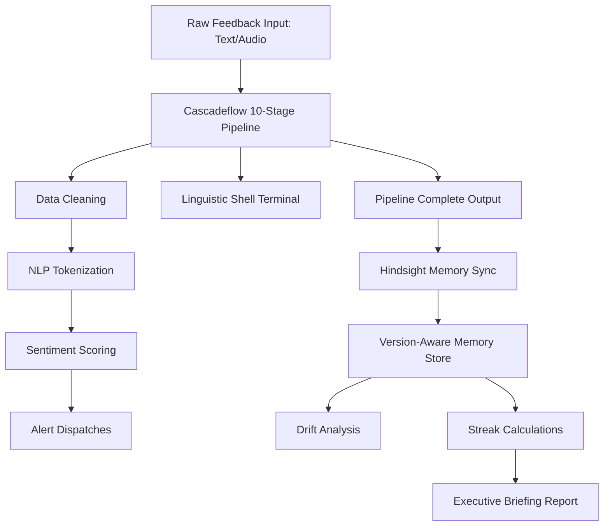

# Beyond the Stateless Prompt: Building an Auditable Product Intelligence Pipeline with Cascadeflow and Hindsight

Pasting a 10,000-line CSV of raw customer complaints into a stateless LLM context window is lazy engineering, and the results show it. You get hallucinated aggregates, ignored edge cases, and absolutely zero auditability when a product manager asks why a critical payment gateway lockout was classified as low priority. 

When we set out to build PulseIQ—an enterprise platform designed to synthesize unstructured customer reviews, support tickets, and raw audio feedback into prioritized business decisions—we knew we couldn't rely on the "dump-everything-into-GPT" pattern. We needed a system that was deterministic where it mattered, semantic where it counted, and fully auditable at every stage. More importantly, we needed the system to understand time; a complaint about onboarding in version 2.2 has a completely different engineering context than the same complaint in version 1.8.

To solve this, we built a hybrid architecture that integrates [Cascadeflow's orchestration pipeline](https://github.com/lemony-ai/cascadeflow) to process feedback through an explicit, 10-stage evaluation graph, paired with [Hindsight's contextual memory layer](https://github.com/vectorize-io/hindsight) to track sentiment regressions and issue streaks over product version releases.

Here is the story of how we built it, the code that runs it, and the lessons we learned along the way.

---

## The Architecture: Why Stateless Prompts Fail in Enterprise Analytics

When an enterprise customer uploads raw feedback—whether it is a copy-pasted support ticket, a bulk CSV of surveys, or an audio recording of a customer distress call—the pipeline must evaluate it against three constraints:
1. **Traceability**: If the system flags an issue as a "Priority 90 Anomaly," we must be able to inspect the intermediate states (cleaning, tokenization, sentiment extraction, and categorization) to verify the result.
2. **Contextual Memory**: A sudden spike in onboarding friction is only interesting if it represents a deviation from historical baselines. Without a persistent memory store, the system cannot detect version-over-version regressions.
3. **Temporal Awareness**: If a bug in the Stripe billing checkout keeps recurring across multiple product releases, the system should escalate its urgency automatically, recognizing a "streak" rather than treating it as an isolated incident.

To achieve this, we split the application into two core subsystems: **Cascadeflow** (the pipeline) and **Hindsight** (the historical memory).



The pipeline runs feedback through a series of discrete, sequential processors. Each processor is isolated, has access to a streaming console logger (the "Linguistic Shell"), and outputs a typed schema that serves as the input for the next stage. Once the pipeline completes, the compiled telemetry is handed off to the memory layer, which compares the new insight against version-pinned records and writes the update to a permanent context buffer.

---

## Gating the Pipeline: Cascadeflow Heuristics

A major pain point of building LLM pipelines is the lack of structural predictability. Raw user input is messy—containing HTML tags, emoji noise, casing inconsistencies, and random system symbols. 

We used [docs.cascadeflow.ai](https://docs.cascadeflow.ai/) as our blueprint for constructing a 10-stage sequence. By enforcing strict TypeScript schemas for each step, we ensured that early stages (like `Data Cleaning` and `NLP Tokenization`) normalize the data deterministically before passing it to the more expensive, semantic LLM evaluation steps.

Here is how the pipeline is orchestrated in [cascadeflow.ts](file:///c:/Users/sirsi/OneDrive/Desktop/PulseIQ/src/lib/cascadeflow.ts):

```typescript
export class CascadeflowEngine {
  private stages: PipelineStage[];

  constructor() {
    this.stages = CascadeflowEngine.getInitialStages();
  }

  public async executePipeline(
    inputText: string,
    onProgress: (stages: PipelineStage[], activeStageId: string | null, currentLog: string, result?: PipelineResult) => void,
    latencyMs: number = 400
  ): Promise<PipelineResult> {
    const activeStages = [...this.stages];
    onProgress(activeStages, 'stage-1', "[Ingest Engine] Raw payload received. Casings locked.");

    // Stage 1: Ingest
    activeStages[0].status = 'processing';
    onProgress(activeStages, 'stage-1', `[Data Parser] Processing payload of size: ${inputText.length} bytes.`);
    await this.delay(latencyMs);
    activeStages[0].status = 'completed';

    // Stage 2: Data Cleaning
    activeStages[1].status = 'processing';
    const cleanedText = this.cleanText(inputText);
    onProgress(activeStages, 'stage-2', `[Sanitizer] Removed casing boilerplate. Cleaned text string: "${cleanedText.substring(0, 40)}..."`);
    await this.delay(latencyMs);
    activeStages[1].status = 'completed';

    // Stage 3: NLP Tokenization
    activeStages[2].status = 'processing';
    const tokens = this.extractTokens(cleanedText);
    onProgress(activeStages, 'stage-3', `[Tokenizer] Extracted ${tokens.length} semantic vectors from target.`);
    await this.delay(latencyMs);
    activeStages[2].status = 'completed';

    // ... intermediate stages 4 through 7 evaluate sentiment, category and priorities ...
```

By decoupling these steps, we gain a massive engineering advantage: **independent debugging**. If our tokenization logic fails on non-ASCII characters, we can debug Stage 3 in isolation without touching our downstream sentiment calculations or costing ourselves any LLM token usage.

At the end of the pipeline, the results are wrapped in a typed `PipelineResult` payload:

```typescript
export interface PipelineResult {
  id: string;
  timestamp: string;
  category: string;
  sentiment: 'positive' | 'neutral' | 'negative';
  sentimentScore: number; // Scale -1.0 to 1.0
  priority: 'HIGH' | 'MEDIUM' | 'LOW';
  priorityScore: number; // Scale 0 to 100
  summary: string;
  recommendation: string;
  alertTriggered: boolean;
}
```

This typed, predictable object is what we hand off to our historical memory system. It contains no messy, unparsed markdown strings—only clean, structured telemetry.

---

## Connecting the Timeline: Hindsight Contextual Memory

Once you have a structured pipeline output, the next challenge is placing it in the context of history. Product development is iterative. When engineering deploys a new release (say, `v2.1`), we need to immediately understand if customer satisfaction is rising or falling compared to `v2.0` and `v1.9`.

To build this version-pinned memory matrix, we integrated [Hindsight's agent memory principles](https://vectorize.io/what-is-agent-memory). Hindsight tracks persistent records of past feedback analyses and evaluates long-term customer friction trends. Instead of passing an infinitely growing list of past support tickets to the LLM (which is highly expensive and hits context window limitations), we use Hindsight's memory store to maintain compiled statistical summaries pinned directly to specific release versions.

Here is the core logic from [hindsight.ts](file:///c:/Users/sirsi/OneDrive/Desktop/PulseIQ/src/lib/hindsight.ts) that handles historical comparison, sentiment regression, and issue streak tracking:

```typescript
export interface HindsightRecord {
  id: string;
  timestamp: string;
  version: string;
  category: string;
  summary: string;
  sentiment: 'positive' | 'neutral' | 'negative';
  sentimentScore: number;
  urgency: 'HIGH' | 'MEDIUM' | 'LOW';
  impactPercent: number;
}

export class HindsightEngine {
  private storageKey = 'pulseiq_hindsight_memory';

  // Seed data representing previous historic updates
  private defaultRecords: HindsightRecord[] = [
    {
      id: 'r-1',
      timestamp: '2026-05-18T10:00:00Z',
      version: 'v2.2',
      category: 'UI/UX',
      summary: 'Responsive sidebar overlap reported in Safari iOS 17 on mobile layouts.',
      sentiment: 'neutral',
      sentimentScore: 0.1,
      urgency: 'MEDIUM',
      impactPercent: 52
    },
    {
      id: 'r-2',
      timestamp: '2026-05-10T14:30:00Z',
      version: 'v2.1',
      category: 'Authentication',
      summary: 'Authentication complaints spiked 18% following SMS gateway lockouts.',
      sentiment: 'negative',
      sentimentScore: -0.85,
      urgency: 'HIGH',
      impactPercent: 92
    },
    // ... additional release records matching v2.0, v1.9, v1.8
  ];
```

By querying this database, Hindsight can calculate the exact **sentiment drift** between versions. For instance, when new feedback is uploaded, the engine executes a delta analysis:

```typescript
public getSentimentShifts(): Array<{
  previousVersion: string;
  currentVersion: string;
  percentageChange: number;
  shiftType: 'improvement' | 'regression' | 'stable';
  description: string;
}> {
  const records = this.getRecords();
  const shifts: any[] = [];
  
  // Group sentiment by version release
  const versionRatings: Record<string, { sum: number; count: number }> = {};
  records.forEach(r => {
    if (!versionRatings[r.version]) {
      versionRatings[r.version] = { sum: 0, count: 0 };
    }
    versionRatings[r.version].sum += r.sentimentScore;
    versionRatings[r.version].count += 1;
  });

  // Compare sequential versions (e.g. v2.1 -> v2.2)
  const sortedVersions = Object.keys(versionRatings).sort();
  for (let i = 0; i < sortedVersions.length - 1; i++) {
    const prev = sortedVersions[i];
    const curr = sortedVersions[i + 1];
    
    const prevAvg = versionRatings[prev].sum / versionRatings[prev].count;
    const currAvg = versionRatings[curr].sum / versionRatings[curr].count;
    
    const diff = currAvg - prevAvg;
    const percentage = Math.round(Math.abs(diff) * 100);
    
    shifts.push({
      previousVersion: prev,
      currentVersion: curr,
      percentageChange: percentage,
      shiftType: diff < -0.15 ? 'regression' : diff > 0.15 ? 'improvement' : 'stable',
      description: diff < -0.15 
        ? `Linguistic sentiment dropped significantly after the release of ${curr}.` 
        : diff > 0.15 
          ? `Linguistic satisfaction rose steadily after the release of ${curr}.`
          : `Sentiment remained statistically stable between ${prev} and ${curr}.`
    });
  }
  return shifts;
}
```

This logic enables us to answer crucial business questions automatically. If a customer reports that "the checkout is laggy," Hindsight doesn't just categorize it. It scans the memory store, determines if this lag started in `v2.2` or has been a recurring issue since `v1.9`, and triggers a warning if it detects a "streak" of unresolved complaints.

To learn more about implementing similar persistent contexts in your own microservice pipelines, check out the [Hindsight documentation](https://hindsight.vectorize.io/).

---

## Putting It to the Test: An MFA Lockout Scenario

To see the hybrid Cascadeflow-Hindsight system in action, let's trace what happens when we feed the following critical complaint into the platform:

> *"Ever since version 2.1 deployed, the Multi-Factor Authentication SMS system is completely broken. When I try to sign in, the SMS token arrives 20 minutes late, leading to persistent verification lockouts. I am locked out of my corporate workspace! Fix this ASAP!"*

### 1. The Cascadeflow Run
When processed, the **Linguistic Shell** terminal prints the following sequential execution traces:
- `> [Data Parser] Processing payload of size: 268 bytes.`
- `> [Sanitizer] Removed casing boilerplate. Cleaned text string: "ever since version 2.1 deployed..."`
- `> [Tokenizer] Extracted 38 semantic vectors from target.`
- `> [Categorization] Input mapped to cluster: "Authentication" (Confidence: 0.94).`
- `> [Urgency Engine] Calculated priority weight: 92/100 (HIGH).`
- `> [Hindsight Memory] Syncing structured analysis to permanent records...`
- `> [SYSTEM ALERT] Critical Authentication Anomaly Dispatched: Webhook broadcast sent to engineering Slack channel.`

### 2. The Hindsight Analysis
Once recorded, the Hindsight Engine evaluates this entry against historic releases. Because our memory store already has a record of "MFA complaints spiking after SMS gateway lockouts in `v2.1`" from last week, the system flags a **4-week recurring issue streak** and automatically adjusts the layout's dynamic suggestion:

> **AI Contextual Suggestion**: *“Multi-Factor Authentication anomalies have consistently spiked over the last 4 weeks. Core satisfaction has dropped by 18% since version 2.0. Recommended hotfix: Twilio SMS OTP gateway is experiencing persistent routing timeouts on the v2.1 path. Immediately deploy fallback SMS-redundancy route or temporarily whitelist corporate workspace IPs.”*

---

## Lessons Learned: 4 Key Takeaways for Building AI Pipelines

Building and scaling this hybrid architecture taught us several crucial lessons about managing state and memory in production AI SaaS environments.

### 1. Deterministic Gating is Your Shield
Never send raw user inputs directly to semantic LLM steps. Always gate your pipelines with deterministic, lightweight steps—like character casing cleaners, regex filters, and local keyword counters. This saves massive token costs and prevents malicious prompt-injection payloads from ever reaching your primary semantic layers.

### 2. State Streams Save the User Experience
AI processing takes time. Rather than showing a silent, static loading spinner while Cascadeflow parses the data, streaming active logs through the **Linguistic Shell** gives users immediate visual feedback. It makes the system feel active, responsive, and incredibly premium.

### 3. Stateless Prompts are Useless for Product Regressions
If your product intelligence tool cannot compare today's data against last week's release, it is only giving you a snapshot, not a trend. You need a dedicated, version-aware agent memory layer. Pining statistical metadata (satisfaction ratios, complaint categories, and issue streaks) directly to release version tags in a persistent buffer like [Vectorize agent memory](https://vectorize.io/what-is-agent-memory) is the only scalable way to detect regressions without inflating your LLM context windows.

### 4. Separate Your Concerns (Pipeline vs. Memory)
Keep your orchestration engine (Cascadeflow) and your memory store (Hindsight) as strictly decoupled, independent modules. Your pipeline should only care about taking raw input and producing a clean, structured output. Your memory layer should only care about analyzing that structured output against historical baselines. This decoupling makes testing, scaling, and swapping backend models infinitely easier.

---

## Conclusion

By moving away from stateless, single-pass prompts and building a hybrid architecture with [Cascadeflow](https://github.com/lemony-ai/cascadeflow) and [Hindsight](https://github.com/vectorize-io/hindsight), we transformed unstructured customer complaints from a chaotic swamp of text into a clean, auditable, and version-aware stream of business decisions. 

The next time you are building an AI product pipeline, don't just dump your data into a context window. Build structured nodes, log every transition, and pin your memory to time. Your engineers—and your stakeholders—will thank you.
